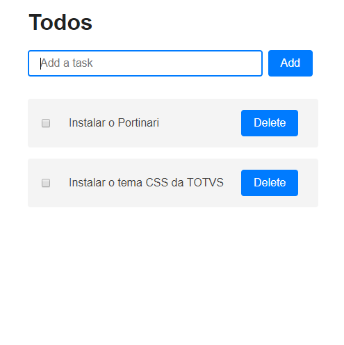

# To Do App

- Criar um novo projeto usando o angular
**ng new to-do-app**;

- Instalar o Portinari;
- Instalar o tema CSS da TOTVS;
- Criar um módulo novo para o App;
- Usar o máximo possível de componentes do Portinari;
- Desenvolver um app de To Do List;
- Os dados podem ser gravados em memória ou local Storage;
- O comprimisso do To Do deve ter uma descrição e uma data;
- Antes de remover da lista deve ser exibida uma mensagem
de confirmação;
- Também deve ser possível marcar a tarefa como completa

**Imagem de Exemplo**
- Na imagem está faltando um campo da data para o To Do

